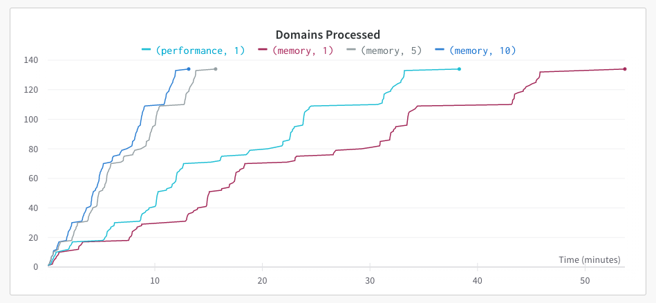

# Deboiler

[DISCLAIMER](./DISCLAIMER.md)


The deboiler is Python module for webpage cleaning, distributed under the Apache License. It is a simple, yet novel, domain cleaning algorithm. Given all pages from a website, it identifies and removes boilerplate elements.

Benefits of the Deboiler approach to webpage cleaning include:

* It is entirely unsupervised and does not need any human annotations.
* It preserves the HTML structure during cleaning and can return a cleaned HTML, as well as a cleaned text.

## Approach

At a high level, `deboiler` detects boilerplate elements by identifying near-identical subtrees (from the html DOM tree) that are shared between two pages in the domain. The following provides more details about the underlying approach:

* <b>Candidate subtrees:</b> A candidate subtree in a page is a node whose html tag is from a limited list (such as  `<div>`, `<nav>`, `<navigation>`, `<footer>`, `<header>`, etc.).

* <b>Subtree comparison:</b> Each subtree is represented with a plain text, that is created recursively by concatenating all of its constituent elements' representations. In this process, html tag attributes are ignored. For instance in node `<a href="https://www.linkedin.com/foo">Linkedin</a>`, attribute `href="https://www.linkedin.com/foo"` is ignored. As a result, subtrees with similar structure and similar text, but potentially different tag attributes, will have the same representations.

* <b>Boilerplate elements from a pair of pages:</b> Given a pair of pages from the same domain, candidate subtrees that are shared (have the same representation) between the two pages are considered boilerplate.

* <b>All domain’s boilerplate elements:</b> Boilerplate elements identified from each pair are added to the set of all boilerplate elements for the domain. We use an efficient method that is only `O(n)` complex, where we sort pages based on URL and compare each page with the next one. It is based on the observation that most modern domains take advantage of folder structures in url paths, and hence, pages with similar parent directories are usually more similar than random pairs. As a result, more boilerplate elements can be identified with less computation.

* <b>Safeguard against identical pages:</b> To have a safeguard against comparing identical pages (and inadvertently denoting all elements as boilerplate), we refrain from using pairs whose intersection-over-union (i.e. ratio of shared elements compared to all elements) is above a certain threshold.

* <b>Cleaning a page:</b> To clean a page from the domain, any subtree in the page that is among the domain’s boilerplate elements is removed.

## Installation

`pip install deboiler`

## How to Use

This package contains an LXML-based, memory-efficient, and fast implementation of this boilerplate detection algorithm, with a simple `scikit-learn`-like API.

```python
from deboiler.dataset import JsonDataset
from deboiler import Deboiler


dataset = JsonDataset("path-to-json-lines-file")
deboiler = Deboiler(
    n_processes=1,  # no of processes
    operation_mode="memory",  # operation mode: `memory` or `performance`
    domain="globality",  # domain name (used for logging only)
)

# call the fit method to identify boilerplate elements
deboiler.fit(dataset)

output_pages = []
# call the transform method to yield cleaned pages
for output_page in deboiler.transform(dataset):
    # do something with the output_page
    output_pages.append(output_page)

```

## Modes of Operation

`deboiler` supports two modes of operation:

* low-memory mode: This mode offers the lowest memory footprint. It also supports multi-processing.

* high-performance mode: In this mode, parsed pages are kept in memory during `fit`, to be reused during `transform`, resulting in faster processing at the cost of higher memory footprint. This mode does _not_ support multi-processing.

|                       | single-processing | multi-processing |
|-----------------------|-------------------|------------------|
| low memory mode       | :heavy_check_mark:                 | :heavy_check_mark:                |
| high performance mode | :heavy_check_mark:                 | :x:               |

The following plot compares `deboiler` performance for different modes of operation and number of processes. In this benchmarking, `deboiler` cleans up pages from ~140 domains with 10-10k pages. The `performance` mode completes the tasks faster (38 mins vs. 54 mins) than the `memory` mode with a single process, i.e. `(memory, 1)`. However, the `memory` mode can outperform the `performance` mode if multi-processing is enabled (e.g. 5 or 10 processes in this example).

It is worth noting that the difference between modes of operation and multi-processing becomes more pronounced as the domain size increases.



## Creating Custom Datasets

The package includes a `JsonDataset` class. It expects a json lines file and has optional arguments to filter for html pages that were crawled successfully.

If the dataset needs to be more nuanced, one can create a custom dataset by sub-classing from the `DeboilerDataset` and implementing `__getitem__` and `__len__` methods, as well as the `urls` property.
It is usually beneficial to create an index of the data during class instantiation that allows for random access to the records in `__getitem__`.
You can refer to [`deboiler/dataset/json_dataset.py`](deboiler/dataset/json_dataset.py) as an example.

### Tests

Run the tests as in

```
bash entrypoint.sh test
```
or simply
```
pytest .
```

Some options:
* `-s` to show prints and be able to debug
* `--pdb` to trigger debugger when having an exception
* `pytest route_to_test` to test a specific test file
* `pytest route_to_test::test_function` to test a specific test function
* `pytest route_to_test::test_function[test_case]`
* ` --cov-report term` to show coverage

You might find other code inspectors in `entrypoint.sh`. Note that these are run
against your code if opening a pull request.


# Contributing

All contributions, bug reports, security issues, bug fixes, documentation improvements, enhancements, and ideas are welcome. This section is adapted and simplified
from [pandas contribution guide](https://pandas.pydata.org/docs/development/contributing.html).

## Submit and issue

Bug reports, security issues, and enhancement requests are an important part of making open-source software more stable and are curated through Github issues. When reporting and issue or request, please fill out the issue form fully to ensure others and the core development team can fully understand the scope of the issue.

The issue will then show up to the community and be open to comments/ideas from others.

## Submit a pull request

`deboiler` is hosted on GitHub, and to contribute, you will need to sign up for a free GitHub account. We use Git for version control to allow many people to work together on the project. If you are new to Git, you can reference some of the resources in the pandas contribution guide cited above.

Also, the project follows a standard forking workflow whereby contributors fork the repository, make changes, create a feature branch, push changes, and then create a pull request. To avoid redundancy, please follow all the instructions in the pandas contribution guide  cited above.

## Code of Conduct

As contributors and maintainers to this project, you are expected to abide by the code of conduct. More information can be found at the [Contributor Code of Conduct]((https://github.com/globality-corp/deboiler/.github/blob/master/CODE_OF_CONDUCT.md)).
